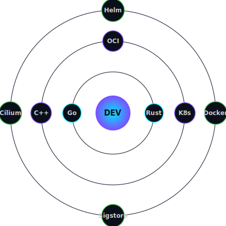

<!--
============================================================
  GitHub Profile README for @hackeramitkumar
  ------------------------------------------------------------
  HOW TO USE:
  1. Create a NEW public repo named EXACTLY: hackeramitkumar
     (repo name must match your username to be a "profile README")
  2. Add this file as README.md at the repo root.
  3. Commit & push. It will render on github.com/hackeramitkumar
  ------------------------------------------------------------
  Optional add-ons noted inline (snake animation workflow, etc.)
============================================================
-->

<!-- ===================== HERO / BANNER ===================== -->

<!-- Custom hand-crafted animated SVG banner (self-hosted, no third-party service) -->

  

  
  
  
  

<!-- ===================== ABOUT ===================== -->
## 🧠 About Me

I'm a **systems-focused software engineer** who loves building **high-performance, security-critical, and cloud-native systems**. My work spans OS internals, distributed systems, and policy enforcement at scale — and I care deeply about **correctness, performance, and clean system design**.

- 🔭 Currently working on **the Internet of Agents** ([AGNTCY](https://github.com/agntcy), Linux Foundation) & **A2A protocol** bindings
- 🛡️ Contributor to **[Kyverno](https://github.com/kyverno/kyverno)** (CNCF) — Sigstore Cosign, OCI v1.1 referrers, image-verification TTL caching
- 🚀 **Kubernetes Cluster API** release team — release notes, CI signal analysis, bug triage
- 🎓 **GSoC Mentor** [@AOSSIE](https://github.com/AOSSIE-Org) · former GSoC contributor · LFX'23 mentee [@kyverno](https://github.com/kyverno)
- 🏅 **CKAD** certified · Cilium Network Policies (Isovalent) · Tuxwars winner
- 📫 Reach me: **amit9116260192@gmail.com**

<!-- Self-typing animated terminal (self-hosted SVG) -->

<!-- ===================== TECH STACK ===================== -->
## 🛠️ Tech Stack

**Languages**

**Cloud, Infra & Networking**

**Security & Systems**

<!--
  Focus areas: Windows Internals & Filesystem Minifilters,
  macOS System Extensions & Endpoint Security Framework,
  IPC, secure policy enforcement, tamper resistance.
-->

<!-- Animated orbiting skill ring (self-hosted SVG) -->

<!-- ===================== GITHUB STATS ===================== -->
## 📊 GitHub Stats

<!--
  These SVGs are generated locally by the "Metrics" GitHub Action
  (.github/workflows/metrics.yml) and committed to this repo, so they
  never depend on rate-limited third-party services.
-->

 

<!-- ===================== ISO CALENDAR ===================== -->
## 🗓️ Contribution Calendar

<!-- ===================== ACTIVITY GRAPH ===================== -->
## 📈 Contribution Activity

<!-- ===================== PINNED / HIGHLIGHTS ===================== -->
## 🌟 Featured Work

| Project | Description | Tech |
| --- | --- | --- |
| [agntcy/slim](https://github.com/agntcy/slim) | Secure Low-Latency Interactive Messaging | `Rust` |
| [a2a-rs](https://github.com/hackeramitkumar/a2a-rs) | A2A Protocol Rust SDK | `Rust` |
| [kyverno](https://github.com/kyverno/kyverno) | Kubernetes-native policy management | `Go` · `Sigstore` · `OCI` |
| [cluster-api](https://github.com/kubernetes-sigs/cluster-api) | Declarative Kubernetes cluster lifecycle | `Go` |

<!-- ===================== SNAKE ANIMATION (optional) ===================== -->
  OPTIONAL: contribution-snake animation.
  1. Create .github/workflows/snake.yml with Platane/snk action.
  2. Uncomment the image below after the workflow runs once.

  

### ⭐ Always excited about open source, infra, security, and well-designed systems.

<!-- Animated wave footer (self-hosted SVG) -->

